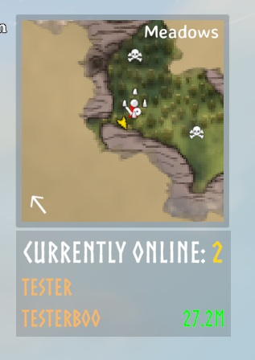

# Server Player List

## See who’s online and how far they are from you!

Ever wondered how many players are currently online on your server, or how far your friends are from you?  
With **Server Player List**, you get a small, unobtrusive panel showing the total number of online players — and, if they’re sharing their location, their names and distances too.

---

### 🧭 Features

- Displays **number of online players** in a small HUD panel.  
- Shows **player names and distances** (only for players who share their location).  
- Toggle between compact and expanded view using **Right Control + O**.  
  - Compact view: only shows the online player count.  
  - Expanded view: shows names and distances.  
- The panel is **draggable** — click and drag to reposition it (easiest with the mouse cursor visible, e.g. in the ESC menu).  
- Fully **client-side** — doesn’t require server installation.

---

### 📸 Screenshot

---

## ⚙️ Manual Installation Instructions
*You must have BepInEx installed.*

1. Locate your Valheim game folder.  
2. Extract the contents of the archive into the `BepInEx\plugins` folder.  
3. Launch the game and look for the Server Player List panel.  
4. Adjust settings in `BepInEx\config\JoksterCube.ServerPlayerList.cfg` if needed.

---

### 🧩 Compatibility

- Client-side only.  
- Works on any server, even if others don’t have the mod installed.  

---

### 💬 Feedback & Support

Report issues or suggest improvements via the mod’s Thunderstore page or GitHub repository.

---

**Author:** JoksterCube  
**Version:** 1.0.0  
**License:** MIT  
